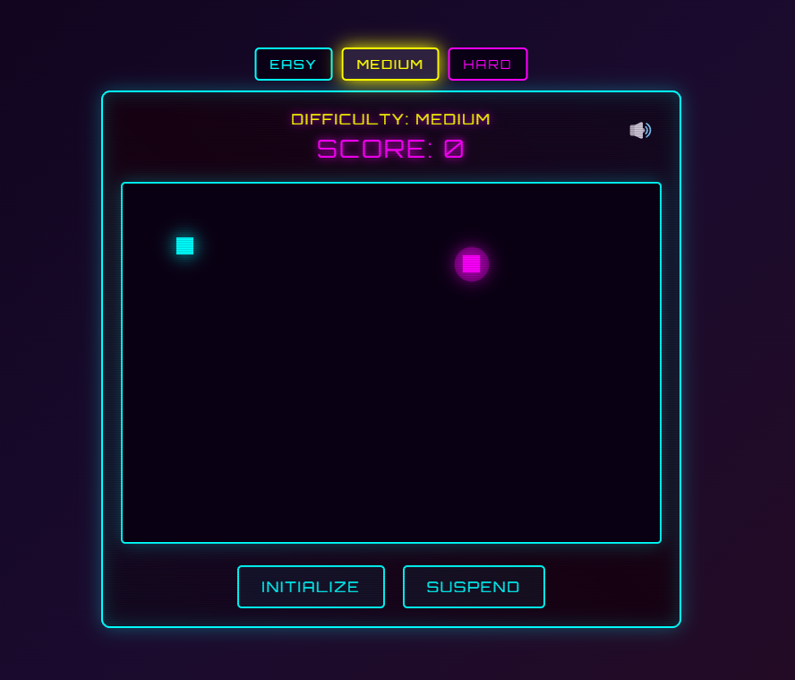

# 🎮 Cyber Snake

<div align="center">




A modern implementation of the classic Snake game with a cyberpunk twist, built using vanilla JavaScript.

[Play Now](https://snake-cyberpunk.netlify.app/) · [Report Bug](https://github.com/YohannHommet/snake_ai/issues)

</div>

## ✨ Features

- 🎮 Classic snake gameplay with modern controls
- 🌟 Cyberpunk visual theme with glitch effects
- 💫 Power-up system (Speed boost, Score multiplier, Time freeze)
- 🏆 High score system with local storage
- 🎵 Retro sound effects
- 🎯 Multiple difficulty levels
- ✨ Particle effects and visual feedback

## 🚀 Getting Started

### Prerequisites

- 🌐 A modern web browser
- 💻 A local web server (can use Live Server extension in VS Code)

### Installation

1. Clone the repository:
```bash
git clone https://github.com/YohannHommet/snake_ai.git
```

2. Navigate to the project directory:
```bash
cd snake_ai
```

3. Start a local server:
   - Using VS Code: Install "Live Server" extension and click "Go Live"
   - Using Node.js: `npx serve`

4. Open your browser and navigate to the local server address (typically `http://localhost:8000`)

## 🎮 Game Controls

- ⬆️ ⬇️ ⬅️ ➡️ Arrow keys to control snake direction
- 🔊 'M' to mute/unmute sound
- ⏸️ Space to pause/resume game
- 🎯 Click difficulty buttons to change game speed

## 🏗️ Project Structure

```
snake-ai/
├── 📁 css/
│ └── style.css
├── 📁 js/
│ ├── game.js
│ ├── snake.js
│ ├── food.js
│ ├── grid.js
│ ├── scoreBoard.js
│ ├── highScoreManager.js
│ ├── powerUpManager.js
│ ├── soundManager.js
│ ├── particleSystem.js
│ ├── visualEffects.js
│ └── difficultyManager.js
├── 📁 sounds/
│ ├── eat.mp3
│ ├── gameOver.mp3
│ ├── powerUp.mp3
│ └── start.mp3
├── 📄 index.html
└── 📄 README.md
```

## 🤝 Contributing

1. Fork the project
2. Create your feature branch (`git checkout -b feature/AmazingFeature`)
3. Commit your changes (`git commit -m 'feat: Add some AmazingFeature'`)
4. Push to the branch (`git push origin feature/AmazingFeature`)
5. Open a Pull Request

## 📝 License

This project is licensed under the MIT License - see the [LICENSE](LICENSE) file for details.

## 🙏 Acknowledgments

- Font: [Orbitron](https://fonts.google.com/specimen/Orbitron)
- Sound Effects: [OpenGameArt](https://opengameart.org/)

## 📬 Contact

Yohann Hommet - [@yohannhommet](https://twitter.com/yohannhommet)

---

<div align="center">

[](https://app.netlify.com/sites/snake-cyberpunk/deploys)  
[https://snake-cyberpunk.netlify.app/](https://snake-cyberpunk.netlify.app/)

Made with ❤️ by [Yohann Hommet](https://github.com/yohannhommet)

</div>